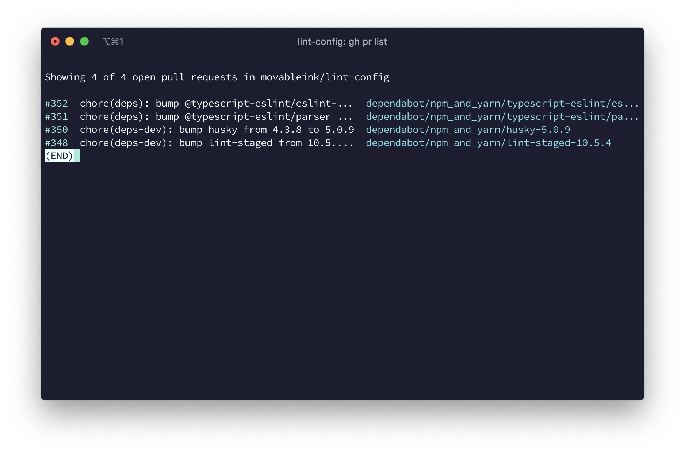
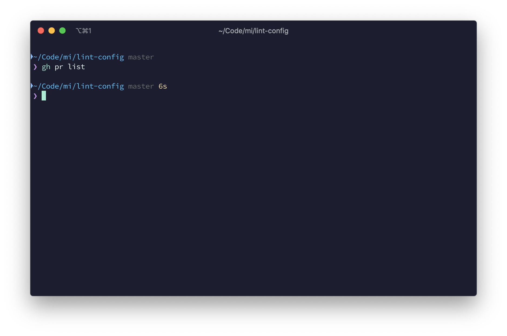
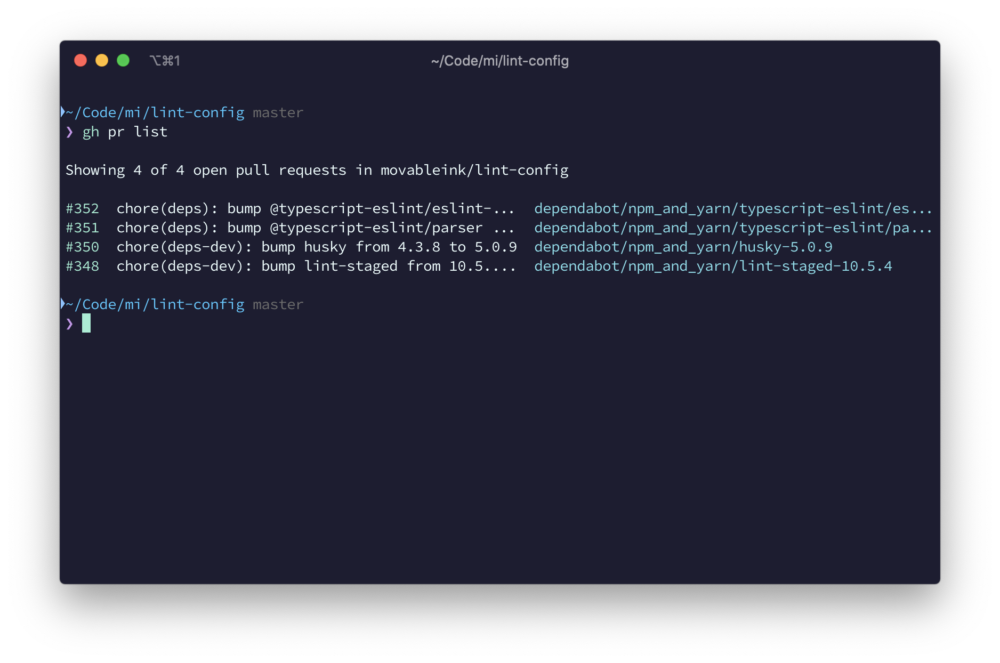

I am a big fan of the GitHub Command Line tool, [`gh`](https://github.com/cli/cli). In particular, it's a great way to list the pull-requests for a repository and then check one out locally for review.

By default, this workflow is a _little_ tricky. When you list your PRs you get a list that is passed automatically through your `$PAGER` program (probably `less`). By default, regardless of how much content there is, you have to actively dismiss `less` to go back to the command line.



Once you've pressed some key, you end up back at your command line... without the pull requests visible anymore!



The problem lies with the workflow between listing the pull requests and checking one out. Followed the previous steps, you've seen your list and dismissed it. Now, do you remember what the number for the PR you want to check out it? If you're anything like me, you have probably already forgotten it! It would be great if we could keep the list visible in our shell history rather than having it disappear.

Thankfully, the `gh` tool allows you to override your `$PAGER` environment variable and use something else instead. If you configure `less` with a few particular flags, you can avoid needing to interact with the keyboard to dismiss the list of pull requests and leave them visible in your command line history.

To configure an alternate pager, you can run this:

```bash
gh config set pager "less -FX"
```

With that in place, the list of pull requests no longer needs any kind of interaction to dismiss it.



Now it's much easier to reference the list of pull requests when checking one out!
