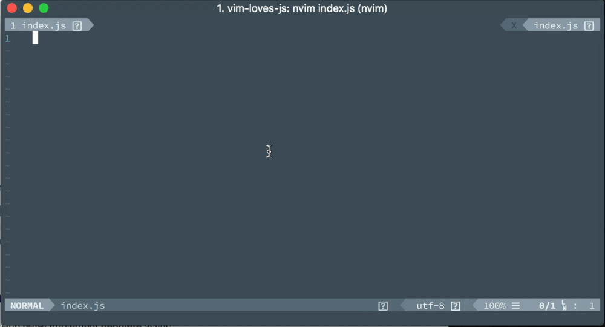
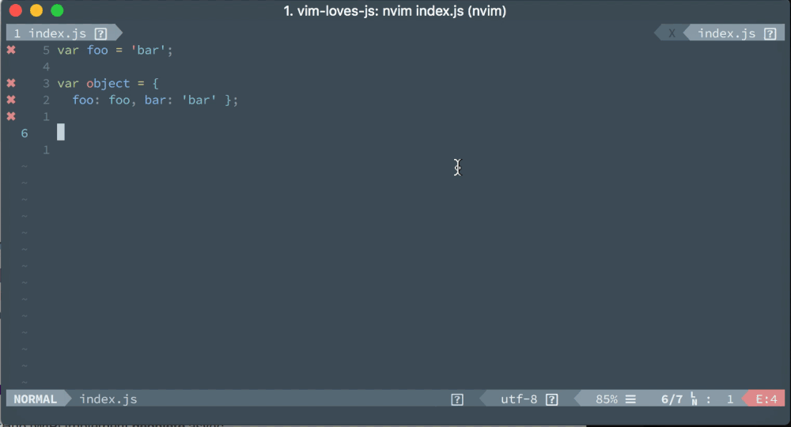
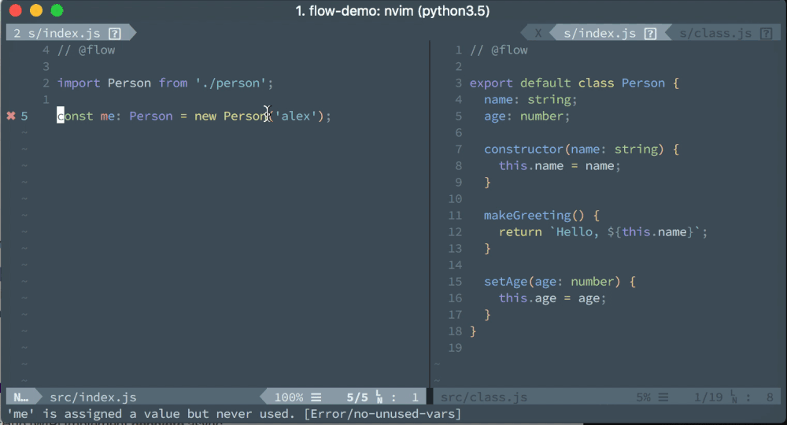

_This post was originally published on Medium. You can view that [here](https://medium.com/@alexlafroscia/writing-js-in-vim-4c971a95fd49)._

---

These days, the experience of writing JavaScript is influenced as much by the tools used during development as those used at runtime. Projects exist that can drastically improve your code quality, from basic help like spotting typos to adding full-blown type checking to a dynamically typed language. As great as these tools are on their own, they're made even more useful when they can be brought directly into your editor. This has given rise to tools like [Visual Studio Code](https://code.visualstudio.com/) with native support for these features. But what is a Vim junky to do?

This post will cover my setup for bringing three core IDE features into Vim:

1. Linting through ESLint
2. Code formatting through Prettier
3. Autocomplete

## A few notes on setting up Vim

I personally use Neovim instead of "regular" Vim. If you're using "regular" Vim, your mileage with these suggestions may vary as some of the plugin features may only be available in Neovim. I highly recommend checking it out if you haven't already.

This post will mostly cover plugins for Vim; if you're not familiar with the concept, [this gist](https://gist.github.com/manasthakur/ab4cf8d32a28ea38271ac0d07373bb53) covers it really well. If you need a TL;DR I highly recommend [`vim-plug`](https://github.com/junegunn/vim-plug), which is what I use.

## Linting in Vim

In general, a linter is a tool that can look at your code and report potential errors without having to run the code. The most popular linter for JavaScript these days is by far [ESLint](https://eslint.org/); it has support for modern JS features (including JSX) and is easily extended with additional rules and features.

If you're not working with ESLint already, getting it installed takes just a few steps (to be run from within an existing JavaScript project):

```bash
yarn add -D eslint
yarn eslint -- --init

# Or, if you're using npm

npm install -D eslint
./node_modules/.bin/eslint --init
```

Installing ESLint into a project through Yarn (or npm)This will install ESLint as a "development dependency" of your project. The initialization will ask how you want to set up your project. This will change based on the specific project you're working on. If you're not sure, I suggest trying out one of the popular suggested configurations.

There are many Vim plugins for running linters but the best experience I've had comes from using [Ale](https://github.com/w0rp/ale). It has some really neat features that set it apart from other solutions, such as running linters asynchronously to avoid locking up the editor and checking your file as you type without needing to save.

With the plugin installed through your method of choice, you're on your way to a great linting experience in Vim. It supports ESLint out of the box and should start working without any additional configuration. If you open a file in your JS project that has a linting error, you'll end up with an experience like this:



Notice the annotations next to erroneous lines, the hint about errors on the current line at the bottom of the screen, and the total number of errors in the bottom-right-hand corner.

## Auto-Format through ESLint and Prettier

With powerful tools like ESLint available for checking code style, decisions around the right way to configure them often arise. Coding style is very personal and these discussions, as basic as they may seem, can cause undue tension between team members. This has given rise to tools like Prettier, which aim to reduce this friction by taking an extremely opinionated stance on code style. Ideally, a few keystrokes in your editor render your file perfectly formatted.

Since we're already working with ESLint, which has its own methods for fixing code (including changes beyond what Prettier would make), we're going to take a two-step approach to fixing code in Vim:

1. Configure ESLint to run Prettier automatically
2. Configure Vim to fix files through ESLint

This will allow Vim to report errors from ESLint and Prettier, and fix both at the same time.

## Prettier through ESLint

The first step is to get ESLint reporting about Prettier errors. There is a plugin/configuration pair provided by the Prettier project that allow us to do just that.

To install, run the following:

```bash
yarn add -D prettier eslint-plugin-prettier eslint-config-prettier

# Or, if you're using npm

npm install -D prettier eslint-plugin-prettier eslint-config-prettier
```

Then, update your ESLint configuration to look something like the following (it's in the root of your project, in case you can't find it):

```json
{
  “extends”: [
    “eslint:recommended”,
    “prettier”
  ],
  “plugins”: [
    “prettier”
  ],
  “rules”: {
    “prettier/prettier”: “error”
  }
}
```

Now, running ESLint will report issues from ESLint and Prettier, and fixing ESLint errors will fix Prettier ones too.

## ESLint through Vim

The setup for running ESLint's fixer from within Vim is actually pretty simple, thanks to the ale plugin that we installed earlier. Not only can it report errors, but it can run fixers too! Add the following to your Vim configuration:

```vim
let g:ale_fixers = {
  \ ‘javascript’: [‘eslint’]
  \ }
```

Now, running `:ALEFix` while editing a JS file will run the fixer on the buffer's content and write the corrected content back to the buffer. You should see all of the fixable errors automatically go away, leaving you to fix the rest yourself (or save the file and continue working).

If you want to make this a bit easier for yourself, I'd recommend adding a shortcut to run `:ALEFix`. You can add something like the following to your Vim configuration file

```vim
nmap <leader>d <Plug>(ale_fix)
```

To let `<leader>d` fix the current file. For me, that means a quick `SPACE-d` before saving makes sure that everything looks good, but that will depend on what your leader key is.



## Autocomplete

The last piece to a modern JS environment is a good autocomplete experience. Vim comes with some basic functionality through `omnicomplete` right out of the box, but with tools like TypeScript and Flow, we can get better integration than that.

My go-to plugin for a richer autocomplete experience is [`deoplete`](https://github.com/Shougo/deoplete.nvim). Deoplete provides an framework for providing autocomplete data to Vim. Some recommended companion plugins are:

- [`deoplete-ternjs`](https://github.com/carlitux/deoplete-ternjs)  -- Autocomplete powered by Tern. Should work with most projects, but less powerful than Flow or TypeScript
- [`deoplete-flow`](https://github.com/steelsojka/deoplete-flow)   -- Autocomplete powered by Flow (demonstrated below)
- [`nvim-typescript`](https://github.com/mhartington/nvim-typescript)  -- Provides Deoplete suggestions plus a bunch of other tools for [TypeScript](https://www.typescriptlang.org/) development



While Vim is certainly usable without this kind of integration, it can be a huge help in preventing runtime errors.

---

I hope you've found these resources useful. For more information on my personal configuration, you can [check out my dotfiles](https://github.com/alexlafroscia/dotfiles/tree/master/nvim) or chat with me on [Twitter](https://twitter.com/alexlafroscia).
